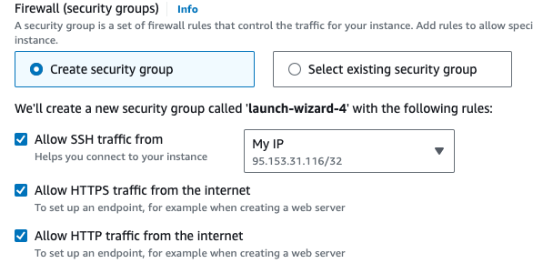
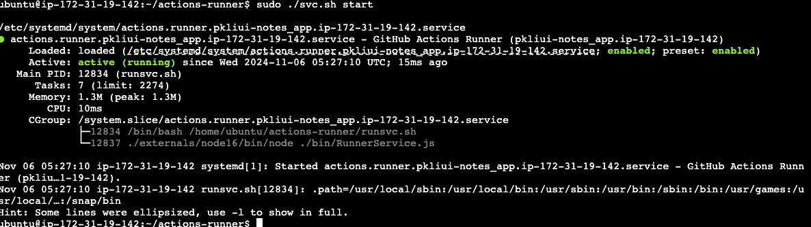

# TypeScript React Node.js application for making daily notes

The following can be seen as some kind of a tutorial one can follow to make a [daily notes application](http://16.171.226.39:8000/). The application allows users to add, modify and delete daily notes through a web interface.

> **Frontend**: Built with TypeScript and React, providing an interactive UI.

> **Backend**: Developed with TypeScript and Node.js. Prisma acts as the ORM to interact with the database, and the Express library is used to set up the API endpoints.

> **Database**: Notes are stored in a PostgreSQL database hosted by Neon.tech.

> **Deployment**: The application is deployed on an AWS EC2 Ubuntu instance using Docker containers.

> **Nginx** is set up both to route traffic to the appropriate services and to serve the static files for the React app.

> **CI/CD**: Managed via GitHub Actions
>


- [TypeScript React Node.js application for making daily notes](#typescript-react-nodejs-application-for-making-daily-notes)
- [Development ](#development-)
  - [Set up the frontend ](#set-up-the-frontend-)
    - [Set up a new React project ](#set-up-a-new-react-project-)
    - [Install additional frontend dependencies ](#install-additional-frontend-dependencies-)
    - [Write frontend code and start your app locally ](#write-frontend-code-and-start-your-app-locally-)
  - [Set up the backend ](#set-up-the-backend-)
    - [Set up a new Node.js project ](#set-up-a-new-nodejs-project-)
    - [Install development dependencies ](#install-development-dependencies-)
    - [Install development and production dependencies ](#install-development-and-production-dependencies-)
    - [Set up a new TypeScript configuration for the backend ](#set-up-a-new-typescript-configuration-for-the-backend-)
    - [Write the backend code ](#write-the-backend-code-)
    - [Setup Prisma and start your server locally ](#setup-prisma-and-start-your-server-locally-)
      - [Configure Prisma](#configure-prisma)
      - [Create or migrate the database items, generate Prisma client](#create-or-migrate-the-database-items-generate-prisma-client)
      - [Start the backend server in development mode](#start-the-backend-server-in-development-mode)
  - [Prototyping and Prisma ](#prototyping-and-prisma-)
- [Dockerise the project for development ](#dockerise-the-project-for-development-)
  - [Frontend Dockerfile.dev for development ](#frontend-dockerfiledev-for-development-)
  - [Backend Dockerfile.dev for development ](#backend-dockerfiledev-for-development-)
  - [Configure Nginx as a Reverse Proxy ](#configure-nginx-as-a-reverse-proxy-)
    - [Create a specific default.conf configuration](#create-a-specific-defaultconf-configuration)
    - [Create Nginx Dockerfile](#create-nginx-dockerfile)
  - [Unite everything with Docker Compose  ](#unite-everything-with-docker-compose--)
- [Production ](#production-)
  - [Modifications to the frontend Dockerfile ](#modifications-to-the-frontend-dockerfile-)
  - [Modifications to the backend  ](#modifications-to-the-backend--)
    - [Modify config files](#modify-config-files)
    - [Modify backend Dockerfile](#modify-backend-dockerfile)
  - [Configure Nginx for serving ](#configure-nginx-for-serving-)
- [Deployment ](#deployment-)
  - [Setup AWS ](#setup-aws-)
    - [Create a new EC2 instance and connect to it](#create-a-new-ec2-instance-and-connect-to-it)
    - [Install docker on EC2](#install-docker-on-ec2)
  - [Setup CI/CD with GitHub Actions ](#setup-cicd-with-github-actions-)
    - [Install runner on EC2](#install-runner-on-ec2)
    - [Add environment variables to Github Secrets](#add-environment-variables-to-github-secrets)
    - [Github Actions CI/CD workflow](#github-actions-cicd-workflow)
    - [Workflow - version 1](#workflow---version-1)
    - [Workflow - version 2 - rolling update with containers' scaling](#workflow---version-2---rolling-update-with-containers-scaling)


<br />
<br />

# Development <a name="development"></a>

- Lets start from developing our application on a local machine. The description below follows the steps I followed on MacOS 11.7.10.


## Set up the frontend <a name="frontend1"></a>

### Set up a new React project <a name="frontend1-new-react"></a>


- Install *Node.js*, the JavaScript runtime, and its *npm* package manager. For example, by using the *nvm* version manager as described here https://docs.npmjs.com/downloading-and-installing-node-js-and-npm

- For frontend, we will use *React*, which is a JavaScript library for building UIs and providing TypeScript support.

- To set up a new React project, we will make use of *create-react-app* which a Node.js package (an npm package) that provides a tool to quickly set up a new React project, install all necessary dependencies, and configure TypeScript in one command.
- Make a new project directory, e.g. "notes_app", and navigate into it. Use Node.js’s package runner to create a new React project with the following command:

```bash
npx create-react-app notesapp-ui --template typescript
```

- The command will create a new *React* project in the "notes_app/notesapp-ui" directory. The *package.json* file will list all dependencies used by the project.

### Install additional frontend dependencies <a name="frontend1-dependency"></a>

- Install *axios*, which is a client library used to make HTTP requests to a backend API. Axios is written in JavaScript and provides TypeScript support:

```bash
npm install axios
```

### Write frontend code and start your app locally <a name="frontend2"></a>

- Write code...
(EXPLANATION PENDING)

- Once done, start the front-end development server:

```bash
npm start
```

- All being well, your browser will automatically open and display your new React app at http://localhost:3000


## Set up the backend <a name="backend1"></a>

- For the backend, we will use *TypeScript* with *Node.js*. Let's set up a new Node.js project that will serve as our backend API.


### Set up a new Node.js project <a name="backend1-nodejs"></a>

- Make a new directory, e.g. "notes_app/notesapp-server", navigate to it and run

```bash
npm init
```
- This command will walk you through creating a package.json file. Keep the defaults, for entry point (the file containing your backend code) specify "./src/index.ts" (or whatever is applicable in your case).

### Install development dependencies <a name="backend1-dev-dependency"></a>

- Next, install the backend development dependencies with "--save-dev" flag as they will be used only for development:

```bash
npm i ts-node typescript nodemon @types/cors @types/express @types/node dotenv --save-dev
```

- ts-node: A TypeScript execution engine for Node.js, allowing you to run .ts files directly
- typescript: The TypeScript compiler, which checks and transpiles your TypeScript code to JavaScript (already included automatically in the frontend by Create React App)
- nodemon: Automatically restarts the server when files change
- @types/express, @types/cors, @types/node: TypeScript type definitions for Express, CORS, and Node.js, providing type safety and autocompletion in your editor
- dotenv: Loads environment variables from a `.env` file into your application during development.

### Install development and production dependencies <a name="backend1-devprod-dependency"></a>

- The rest of the dependencies are required for both development and production because they are required for the application to run:
- @prisma/client: The Prisma Client library, used in the code to interact with the database
- express: A web framework for Node.js, used to create API endpoints
- cors: Middleware to enable Cross-Origin Resource Sharing, allowing your frontend and backend to communicate.
- prisma: Provides the Prisma CLI for database schema management and migration tools.
- @prisma/adapter-better-sqlite3 is a Prisma adapter that lets Prisma use better-sqlite3 as the database driver instead of the default driver (note: for e.g. postgresql database you would need another dependency)

```bash
npm i cors express @prisma/client@latest prisma@latest @prisma/adapter-better-sqlite3@latest
```

- The list of dependencies in your "notes_app/notesapp-server/package.json" file will be updated.

### Set up a new TypeScript configuration for the backend <a name="backend1"></a>

- Use the TypeScript compiler command-line tool (*tsc*) that comes with the *typescript* package to set up a new TypeScript configuration that will control how TS compiles and checks the code:

```bash
npx tsc --init
```

- This command will create a *tsconfig.json* file in your "notes_app/notesapp-server" directory.
- You can modify this file later to adjust settings for production.
```json
{
  "compilerOptions": {
    "target": "es2016",                                  /* Set the JavaScript language version for emitted JavaScript and include compatible library declarations. */
    "module": "commonjs",                                /* Specify what module code is generated. */
    "esModuleInterop": true,                             /* Emit additional JavaScript to ease support for importing CommonJS modules. This enables 'allowSyntheticDefaultImports' for type compatibility. */
    "forceConsistentCasingInFileNames": true,            /* Ensure that casing is correct in imports. */
    "strict": true,                                      /* Enable all strict type-checking options. */
    "skipLibCheck": true                                 /* Skip type checking all .d.ts files. */
  }
}
```

- Next, open your *package.json* file and in "scripts" add a new script for the development mode to run *nodemon* executable.
- Nodemon continuously monitors changes in your code and restarts the application automatically when any changes are detected:

```bash
"scripts": {
  "dev": "nodemon"
}
```

### Write the backend code <a name="backend2"></a>

- Write your backend code in "notes_app/notesapp-server/src/index.ts" file.

(EXPLANATION ABOUT BACKEND CODE PENDING)

- We specify that our Express application will listen on port 5000 for backend requests:

```typescript
const PORT = process.env.PORT || 5000;

app.listen(PORT, () =>{
        console.log(`server running on localhost:${PORT}`)
});
```

### Setup Prisma and start your server locally <a name="backend3"></a>

*Prisma* is a database toolkit and Object-Relational Mapping (ORM) library for Node.js and TypeScript. It allows you to define your database schema in a declarative way and generates a type-safe client for querying your database from TypeScript or JavaScript code. To get started, initialize Prisma in your backend project:

```bash
npx prisma init
```

This command will:
- Create a prisma directory in your backend project (e.g., notes_app/notesapp-server/prisma/)
- Generate a schema.prisma file where you define your database models and configuration
- Create an .env file in your project root for environment variables, such as your database connection string
- Generate a prisma.config.ts file, which allows you to customize Prisma CLI behavior, such as specifying the schema location, migrations path, or overriding the datasource URL using environment variables.

#### Configure Prisma

**Schema file**

- More info: https://pris.ly/d/prisma-schema
- In "prisma/schema.prisma" file, specify binary targets in the generator block (for example, I will deploy on Linux) and define your data models
- In the datasource block, specify the database provider, e.g. sqlite or postgresql etc.
- If you want to define the database model directly in schema.prisma, specify the model sructure too

Example for sqlite:

```typescript
generator client {
  provider = "prisma-client"
  output   = "../src/generated/prisma"
  binaryTargets = ["native", "linux-musl-openssl-3.0.x"]
}

datasource db {
  provider = "sqlite"
}

model Note{
  id      Int @id @default(autoincrement())
  title   String
  content String
}
  ```
**.env**

- Specify the database URL, example for sqlite:
```
DATABASE_URL="file:./dev.db"
```
- add .env to .gitignore and .dockerignore

**prisma.config.ts**

- You can leave as it is The DATABASE_URL field was added automatically and will be read from .env.

#### Create or migrate the database items, generate Prisma client

- If you defined your database models in `prisma.schema` (as shown above), create the corresponding tables in your database by running:
```bash
npx prisma migrate dev
```

- If you already have an existing database and want Prisma to introspect its structure and update your schema.prisma file accordingly, run:
```bash
npx prisma db pull
```

- Generate the Prisma Client, run
```bash
npx prisma generate
```

- This command reads your `schema.prisma` file and creates a type-safe client in your project, allowing you to start querying your database from your Node.js/TypeScript code.

- For any schema changes, use `npx prisma migrate dev` during development to create and apply migrations, or `npx prisma migrate deploy` in production.

> **Note:** In production, you will not use the `.env` file created during development. Instead, you will recreate it inside the Docker container by reading the `DATABASE_URL` value from GitHub secrets (see the production section below)

#### Start the backend server in development mode

To start your backend server with automatic restarts on code changes, run:

```bash
npm run dev
```
(or equivalently, npx nodemon)

- Express will now be running on port 5000. If you visit http://localhost:5000/api/notes, you will see the notes available in your database.
- Switch back to the UI window you previously opened at http://localhost:3000, refresh the page, and you should see it updated with notes from the database.

## Prototyping and Prisma <a name="backend4"></a>

- To inspect an already existing database, you can run ```npx prisma studio```

- During the development stage, you may want to make changes to your "prisma.schema" file, e.g.  adding another model.

- For quick prototyping, Prisma recommends running `npx prisma generate` to generate a new Prisma Client (by default, this is generated into `./node_modules/.prisma/client`), followed by `npx prisma db push` to apply your schema changes directly to the database. **Note:** `prisma db push` does not keep a history of schema changes.

- To maintain a history of your database changes, use `npx prisma migrate dev` during development. This command creates migration files under `prisma/migrations`. For production deployments, use `npx prisma migrate deploy` to apply migrations in a controlled way.

<br />
<br />
<br />

# Dockerise the project for development <a name="dockerise"></a>

- After getting your application working locally, the next step is to deploy it so users can access it—for example, on an AWS EC2 instance. While you could manually repeat all setup steps on the server, this approach is error-prone and hard to maintain.

- To make deployment more robust and reproducible, we will use Docker containers. Docker containers ensure a consistent and isolated environment across development, testing, and production, making your application easier to run on any machine. In production, Docker also enables scalability and near-zero downtime updates by allowing you to run multiple containers and update them seamlessly.

- To get started with local development, install Docker and Docker Desktop on your computer.

<br />

## Frontend Dockerfile.dev for development <a name="dockerise1"></a>

> [!WARNING]  **Create new .dockerignore and .gitignore files and add "node_modules" to these files as we do not want "node_modules" to be copied from the local machine**
>
- Go to your frontend folder "notes_app/notesapp-ui/" and make the following Dockerfile.dev there:

<br />

```docker
FROM node:lts-alpine

WORKDIR /app
COPY ./package*.json ./
RUN npm i

COPY . .

CMD ["npm", "run",  "start"]
```

<br />

- We use node:lts-alpine distribution because of its small size and do the following:
- Set the work directory inside Docker to "/app" and copy package.json files into there
- Install all dependencies  specified in these json files by running ```RUN npm i``` and copy the rest of the content from your local folder "notes_app/notesapp-ui" to the work folder in Docker
- Run ```CMD ["npm", "run",  "start"]``` that will run our "start" script defined in package.json (```"start": "react-scripts start"```).

- In the following, we will use docker compose to run our application, but one can test the  dockerfile already now:

    ```bash
    docker build -t notesapp-ui -f Dockerfile.dev .

    docker run -t notesapp-ui -p 3000:3000
    ```

    - Head to http://localhost:3000 to see the UI running inside of our docker container. At this point it has no access to the database yet.


<br />

## Backend Dockerfile.dev for development <a name="dockerise2"></a>

- Similarly, we make a Dockerfile.dev for the backend in "notes_app/notesapp-server" directory.

> [!WARNING]  **Create new .dockerignore and .gitignore files and add "node_modules"  and "/src/generated/prisma" to these files as we do not want "node_modules" to be copied from the local machine**. Do not add .env to dockerignore for development because it will be used by Dockerfile.
>
```docker
FROM node:lts-alpine

WORKDIR /app
COPY ./package*.json ./
RUN npm i

COPY . .
COPY .env ./

RUN npx prisma migrate dev
RUN npx prisma migrate status

CMD ["npm", "run",  "dev"]

```

- We use node:lts-alpine distribution because of its small size
- Set the work work directory inside the Docker to "/app" and copy package.json files to there
- Install all dependencies  specified in these json files by running ```RUN npm i``` and copy the rest of the content from your local folder "notes_app/notesapp-server" to the work folder in Docker

- Run ```npx prisma migrate dev``` to migrate any changes that could have happened to the prisma.schema file.

- Finally, run ```CMD ["npm", "run",  "dev"]``` that will run nodemon, as defined in package.json (``` "dev": "nodemon"```).

- In the following, we will use docker compose, but one can test the dockerfile already now:

    ```bash
    docker build -t notesapp-server -f Dockerfile.dev .
    docker run -t notesapp-server -p 5000:5000
    ```
  - Head to http://localhost:5000/api/notes to see the database content

<br />


## Configure Nginx as a Reverse Proxy <a name="dockerise3"></a>

- At this stage, both the frontend and backend of our application have been containerized. The next step is to enable communication between them and expose the application to users through a single entry point. We achieve this by using *docker-compose* to orchestrate our containers and *Nginx* as a reverse proxy.

### Create a specific default.conf configuration

- To configure Nginx as a reverse proxy, navigate to the project's root directory and create an "nginx" folder. Inside this folder ("notes_app/nginx"), create a file named default.conf with the following content:

```nginx
upstream frontend {
    server frontend_service:3000; # frontend service in docker compose
}

upstream backend {
    server backend_service:5000; # backend service in docker compose
}

server {
    listen 80; # nginx listens on port 80

    location / {
        proxy_pass http://frontend;
    }

    location /api {
        proxy_pass http://backend;
    }
}
```

- The `upstream` blocks define groups of servers (frontend and backend) that Nginx can forward requests to. These groups are referenced later in the `proxy_pass` directives inside the `server` block.
- In our Docker Compose setup, the frontend and backend services are available on ports 3000 and 5000, and are named `frontend_service` and `backend_service` respectively. These names are used in the Nginx config to route traffic to the correct containers.
- The `server` block is the main Nginx configuration. It listens on port 80 and uses `location` blocks to route incoming requests: requests to `/api` are forwarded to the backend service, while all other requests are sent to the frontend service.

### Create Nginx Dockerfile

- Create a new Dockerfile.dev for Nginx, where we use an Nginx' image and replace its default settings file with the file that we have just created on local

```docker
FROM nginx
ADD ./default.conf /etc/nginx/conf.d/default.conf
```

- We will use the same Nginx Dockerfile both for development and production

<br />

## Unite everything with Docker Compose  <a name="dockerise4"></a>

- Next, create a `docker-compose-dev.yml` file in your main project directory (`notes_app`).
- Define three services: one for Nginx (the reverse proxy), one for the frontend, and one for the backend.
- Map the relevant folders from our local machine into the corresponding Docker containers
- Create an anonymous (container-only) volume for the /app/node_modules directory inside the container, which acts as a reserved space inside the container where Docker installs all the required Node.js modules..
- For the backend, we also reference the local `.env` file containing the `DATABASE_URL` environment variable. (In production, this file will be recreated using GitHub Actions' Secrets.)

<br />
<br />

```docker
version: '3.8'

services:

  nginx:
    depends_on:
      - frontend
      - backend
    restart: always
    build:
      dockerfile: Dockerfile.dev
      context: ./nginx
    ports:
      - "8000:80"


  frontend:
    build:
      dockerfile: Dockerfile.dev
      context: "./notesapp-ui"
    volumes:
      - /app/node_modules
      - ./notesapp-ui:/app
    ports:
      - "3000:3000"


  backend:
    build:
      dockerfile: Dockerfile.dev
      context: "./notesapp-server"
    volumes:
      - /app/node_modules
      - ./notesapp-server:/app
    ports:
      - "5000:5000"
    environment:
      - .env
```

- Run the docker compose file

```bash
docker compose -f docker-compose-dev.yml up --build
```

- We should be able to see our application fully functional under http://localhost:8000.


<br />
<br />
<br />

# Production <a name="production"></a>


## Modifications to the frontend Dockerfile <a name="production1"></a>

- We need to slightly modify our Dockerfile for production. The first lines up to "COPY" are equivalent to what we have in our development Dockerfile.dev
- "npm run build", as defined in "package.json", is ```"build": "react-scripts build"``` and will put all the build files under the "app/build" folder

- In the second part we use an Nginx image and copy the content of the "app/build" folder into the  "/usr/share/nginx/html" directory, where nginx will serve the frontend (see the next step below)
- Then we remove the default Nginx' conf file and replace it with ours
- Port 3000 is exposed for frontend and ``` CMD ["nginx", "-g", "daemon off;"]``` starts Nginx
-

```docker
FROM node:lts-alpine as build

WORKDIR /app
COPY ./package*.json ./
RUN npm i

COPY . .

RUN npm run build

# second part with nginx
FROM nginx:1.21.4-alpine

COPY --from=build /app/build /usr/share/nginx/html
RUN rm /etc/nginx/conf.d/default.conf
COPY ./nginx/default.conf /etc/nginx/conf.d

EXPOSE 3000
CMD ["nginx", "-g", "daemon off;"]
```
<br />

## Modifications to the backend  <a name="production2"></a>

### Modify config files

- Ensure that we modified the tsconfig.json so that we specified an output folder for the JavaScript files generated by TypeScript compiler


```json
{
  "compilerOptions": {
    "target": "es2016",                                  /* Set the JavaScript language version for emitted JavaScript and include compatible library declarations. */
    "module": "commonjs",                                /* Specify what module code is generated. */
    "moduleResolution": "node",                     /* Specify how TypeScript looks up a file from a given module specifier. */
    "sourceMap": true,                                /* Create source map files for emitted JavaScript files. */
    "outDir": "dist",                                   /* Specify an output folder for all emitted files. */
    "esModuleInterop": true,                             /* Emit additional JavaScript to ease support for importing CommonJSmodules.
    "forceConsistentCasingInFileNames": true,            /* Ensure that casing is correct in imports. */
    "strict": true,                                      /* Enable all strict type-checking options. */
    "skipLibCheck": true                                 /* Skip type checking all .d.ts files. */
  }
}
```

- Modify package.json to have these scripts for production:
```json
"scripts": {
  "dev": "npx nodemon",
  "build": "NODE_ENV=production npx tsc",
  "start": "NODE_ENV=production node --trace-deprecation dist/index.js"
},
```
- In the above, npx tsc runs the TypeScript compiler (tsc) to transpile our TypeScript code into JavaScript (and put it into "dist" folder) and node runs the compiled index.js file


### Modify backend Dockerfile


- The first lines up to "COPY" are equivalent to what we have in our development Dockerfile.dev
- ```RUN npx prisma generate``` generates a new Prisma Client for us and ``` RUN npx prisma migrate deploy``` migrates any changes in the prisma.schema file

- The following "build" and "start" commands are defined in the package.json file and port 5000 is exposed for the backend

```docker
FROM node:lts-alpine

WORKDIR /app
COPY ./package*.json ./
RUN npm i

COPY . .

RUN npx prisma generate
RUN npx prisma migrate deploy

EXPOSE 5000
RUN npm run build
CMD ["npm", "run",  "start"]
```


<br />

## Configure Nginx for serving <a name="production3"></a>

- We will serve our built React application with Nginx. Make a new folder "nginx" under "notes_app/notesapp-ui/" and a new default.conf file in it:

```nginx
server {
    listen 3000;

    location / {
        root /usr/share/nginx/html;
        index index.html index htm;
        try_files $uri $uri/ /index.html;

    }
}
```

- We listen on port 3000 and we are serving index.html file from folder "/usr/share/nginx/html"

- We should be able to see our application fully functional under http://localhost:8000.


<br />
<br />
<br />

# Deployment <a name="deploy"></a>

## Setup AWS <a name="deploy1"></a>

### Create a new EC2 instance and connect to it


- Under "Instances/Launch instance" select the base image (I have picked Ubuntu 22.04)

- Generate an SSH key pair so that we can connect to the machine over the internet. Save the generated .pem file to .ssh folder on your PC, by moving it from, e.g. Downloads folder

```bash
cd ~/Downloads
mv ec2-docker.pem ~/.ssh
```

- Setup the firewall policy (security groups) to allow HTTP and HTTPS traffic so that our app is available for external users and allow SSH access to the machine only from my own IP address



- Also, specify the ports you would like to set free for the traffic (e.g. 8000 will be used for nginx in our case)

- Click on "Launch instance" and connect to it in order to proceed with the configuration. One can do this either via "EC2 instance connect" or "SSH client", e.g. from the VSC terminal. Ensure your key is not publicly viewable


```bash
cd ~/.ssh
chmod 400 "ec2-docker.pem"
```

- Connect
```bash
ssh -i "~/.ssh/ec2-docker.pem" ubuntu@ec2-16-170-246-89.eu-north-1.compute.amazonaws.com
```
<br />

### Install docker on EC2

- Once logged in, update and upgrade

```bash
sudo apt update && sudo apt upgrade
```

- Install from the official docker repository as installing through Ubuntu may not yield the latest version

-  Retrieve Docker's GPG key (a security key to verify the authenticity of docker) and add it to the system. For that, install curl to be able to download the key via HTTPS and ca-certificates to verify an authenticity of the sites. Make a directory under "/etc/apt/keyrings"  to keep that key. Download the key and modify the permissions to allow apt to access it. Finally, add the docker repository to apt sources and update the list:

```bash
# Add Docker's official GPG key:
sudo apt-get update
sudo apt-get install ca-certificates curl
sudo install -m 0755 -d /etc/apt/keyrings
sudo curl -fsSL https://download.docker.com/linux/ubuntu/gpg -o /etc/apt/keyrings/docker.asc
sudo chmod a+r /etc/apt/keyrings/docker.asc

# Add the repository to Apt sources:
echo \
  "deb [arch=$(dpkg --print-architecture) signed-by=/etc/apt/keyrings/docker.asc] https://download.docker.com/linux/ubuntu \
  $(. /etc/os-release && echo "$VERSION_CODENAME") stable" | \
  sudo tee /etc/apt/sources.list.d/docker.list > /dev/null
sudo apt-get update
```

- Install docker packages
```bash
sudo apt-get install docker-ce docker-ce-cli docker-compose-plugin
```

- Verify with hello world
```bash
sudo docker run hello-world
```


- Add current user to docker group
```bash
sudo usermod -aG docker $USER
```
- Change the permissions of docker socket to be able to connect to the docker daemon
```bash
sudo chmod 660 /var/run/docker.sock
```
<br />


 ## Setup CI/CD with GitHub Actions <a name="deploy2"></a>


 We will use GitHub Actions to automatically deploy our application whenever any changes occur in the main branch.

 The runner will be listening and waiting for you to push the code into the  main branch and once you do, it will trigger a set commands that will update the code on EC2 instance, re-build dockerfiles and push them into the registry as well as smoothly update the running containers.


### Install runner on EC2

- To install a runner, follow the instructions here https://github.com/pkliui/notes_app/settings/actions/runners/new up until # Create the runner and start the configuration experience:

Copy the required commands from Github Actions.

```bash
# Create a folder
mkdir actions-runner && cd actions-runner
# Download the latest runner package
curl -o actions-runner-linux-x64-2.320.0.tar.gz -L https://github.com/actions/runner/releases/download/v2.320.0/actions-runner-linux-x64-2.320.0.tar.gz
# Optional: Validate the hash
echo "93ac1b7ce743ee85b5d386f5c1787385ef07b3d7c728ff66ce0d3813d5f46900  actions-runner-linux-x64-2.320.0.tar.gz" | shasum -a 256 -c
# Extract the installer
tar xzf ./actions-runner-linux-x64-2.320.0.tar.gz
```

- Upon extracting the installer, you should see a bunch of files under actions-runner. Create a runner and configure it:

```bash
# Create the runner and start the configuration experience
./config.sh --url https://github.com/pkliui/notes_app --token YOURGITHUBTOKENHERE
```

- Now you can configure the self-hosted runner application as a service to automatically start the runner application when the machine starts. On the runner machine, open the shell in a directory where you installed the self-hosted runner application. To install the service run:

```bash
sudo ./svc.sh install
```

- Start the service with the following command:
```bash
sudo ./svc.sh start
```

- Now the service should be enabled and active (running):


- Whenever needed, check the status of the service with the following command:
```bash
sudo ./svc.sh status
```

<br />

 ### Add environment variables to Github Secrets

- In development, we used .env file where we stored our ```DATABASE_URL``` variable. In  production, we will store this and other variables in GitHub secrets and recreate this file insode the docker container.
- In your Github repository, go to Settings -> Secrets and variables -> Actions. And under "Repository secrets", add the following new secrets:

DATABASE_URL: Set the ```DATABASE_URL``` to point to your existing database. For local development, we saved it in the .env file locally. For deployment, we will use an environment variable in GitHub secrets instead.

DOCKER_USERNAME: Your DockerHub username.

DOCKER_TOKEN: Will be used instead of a password for docker CLI authentication. You can create one under https://app.docker.com/settings/personal-access-tokens

<br />


### Github Actions CI/CD workflow

The last step that needs to be done is to setup the CI/CD workflow that will be executed once there are any changes in the main branch. In the following, I present two versions that worked or me. I have eventually opted or the second workflow as it is more robust and results in a shorter downtime for the application.


### Workflow - version 1

- With this approach, you will have a longer downtime because you stop the old and then start the new containers
- In short, checkout the code from the repo, build and push the updated images for frontend, backend and nginx to Docker Hub.
- Use the GitHub secrets to login to Docker Hub and connect to the database.
- Nginx keeps routing to the old containers at the moment. Stop them with "docker compose down --volumes".
- Pull the images you have just pushed to Docker Hub and launch the respective containers with "docker compose up -d --build"

<details>
<summary>Click to expand workflow 1</summary>

```{r echo=FALSE}
name: notes_app CI

on:
  push:
    branches: [ main ]

jobs:
  check-out-and-update-docker-images:
      runs-on: [self-hosted]
      steps:
        - name: Checkout code from the github repo
          uses: actions/checkout@v2

        - name: Log in to Docker Hub
          uses: docker/login-action@v2
          with:
            username: ${{secrets.DOCKER_USERNAME}}
            password: ${{secrets.DOCKER_TOKEN}}

        - name: Build and push Docker images for frontend, backend and nginx
          run: |

            cd ~/actions-runner/_work/notes_app/notes_app/notesapp-server
            echo "DATABASE_URL=${{secrets.DATABASE_URL}}" > .env

            cd ~/actions-runner/_work/notes_app/notes_app/notesapp-ui
            docker build -t pkliui/notes_app:notes_app-frontend .
            docker push pkliui/notes_app:notes_app-frontend
            cd ..

            cd ~/actions-runner/_work/notes_app/notes_app/notesapp-server
            docker build -t pkliui/notes_app:notes_app-backend .
            docker push pkliui/notes_app:notes_app-backend
            cd ..

            cd ~/actions-runner/_work/notes_app/notes_app/nginx
            docker build -t pkliui/notes_app:notes_app-nginx .
            docker push pkliui/notes_app:notes_app-nginx
            cd ..

  deploy-updated-containers:
        runs-on: [self-hosted]
        needs: check-out-and-make-docker-builds
        steps:
          - name: Checkout code
            uses: actions/checkout@v2

          - name: Log in to Docker Hub
            uses: docker/login-action@v2
            with:
              username: ${{secrets.DOCKER_USERNAME}}
              password: ${{secrets.DOCKER_TOKEN}}

          - name: Pull Docker images and deploy
            run: |

                cd ~/actions-runner/_work/notes_app/notes_app/notesapp-server
                echo "DATABASE_URL=${{secrets.DATABASE_URL}}" > .env

                cd ~/actions-runner/_work/notes_app/notes_app/notesapp-ui
                docker pull pkliui/notes_app:notes_app-frontend
                cd ..
                cd ~/actions-runner/_work/notes_app/notes_app/notesapp-server
                docker pull pkliui/notes_app:notes_app-backend
                cd ..
                cd ~/actions-runner/_work/notes_app/notes_app/nginx
                docker pull pkliui/notes_app:notes_app-nginx
                cd ..

                docker compose down --volumes
                docker compose up -d --build
```

</details>
<br />

- In docker-compose.yml file, we can keep the port mappings equivalent to those used in development, i.e. explicitly mapping 3000:3000 and 5000:5000


<br />

### Workflow - version 2 - rolling update with containers' scaling

- The downtime can be reduced by scaling the number of containers with "docker-compose --scale" and performing a rolling update as described below.


- Initiate the workflow at a push on the main branch

```yaml
 on:
  push:
    branches: [ main ]
```

- We will have a single job running on our self-hosted EC2 instance with a multiple steps. First, checkout the code from the repository:

```yaml
jobs:
  perform-rolling-update:
    runs-on: self-hosted
    steps:
      - name: Checkout code from the github repo
        uses: actions/checkout@v2
```

- Create an environment file containing the database URL
```yaml
- name: Create an environment file
        run: |

          cd ~/actions-runner/_work/notes_app/notes_app/notesapp-server
          echo "DATABASE_URL=${{secrets.DATABASE_URL}}" > .env
```


- Login to docker hub, build new images and push them to docker hub
```yaml
- name: Log in to Docker Hub
        uses: docker/login-action@v2
        with:
          username: ${{secrets.DOCKER_USERNAME}}
          password: ${{secrets.DOCKER_TOKEN}}

      - name: Build and push updated Docker images for frontend, backend and nginx
        run: |

          cd ~/actions-runner/_work/notes_app/notes_app/notesapp-ui
          docker build -t pkliui/notes_app:notes_app-frontend .
          docker push pkliui/notes_app:notes_app-frontend
          cd ..

          cd ~/actions-runner/_work/notes_app/notes_app/notesapp-server
          docker build -t pkliui/notes_app:notes_app-backend .
          docker push pkliui/notes_app:notes_app-backend
          cd ..

          cd ~/actions-runner/_work/notes_app/notes_app/nginx
          docker build -t pkliui/notes_app:notes_app-nginx .
          docker push pkliui/notes_app:notes_app-nginx
          cd ..
```

- At this point, docker should still be running containers with the previous version of the code

```yaml
- name: Containers before scaling up
  run: docker ps -a
```

- Now, given the newly built images, scale up the number of containers (frontend and backend)
```yaml
- name: Scale up containers, nginx keeps routing to the old ones
  run: docker compose up -d --scale frontend=2 --scale backend=2 --wait
```

- Reload Nginx without rescaling or restarting its container
```yaml
- name: Reload nginx without restarting its container
  # in the following, $(sudo docker ps -q | xargs sudo docker inspect --format='{{.Name}}' | grep notes_app-nginx) command gets the containers' name (most probably notes_app-nginx-1),
  # given the nginx image is notes_app-nginx
  run: docker exec $(sudo docker ps -q | xargs sudo docker inspect --format='{{.Name}}' | grep notes_app-nginx) nginx -s reload
```

- You should be able to see the newly added containers. Nginx is still routing to the old frontend and backend containers at this point.
```yaml
- name: Containers after scaling up
  run: docker ps -a
```

- Replace the old frontend container with the new one. Get the old container's ID by using timestamp, stop and remove it. Scale the number of frontend containers back to 1 and reload Nginx so that it now routes the traffic through the new container.

```yaml
- name: Update the frontend
        run: |

          # get the "old" container ID (this is the currently running container)
          old_frontend_id=$(docker ps -f name=notes_app-frontend --format '{{.ID}} {{.CreatedAt}}' | sort -k2,3 | head -n 1 | awk '{print $1}')
          # take the old container offline
          docker stop $old_frontend_id
          docker rm $old_frontend_id
          # put the new container into use and reload nginx
          docker compose up -d --scale frontend=1 --wait
          docker exec $(sudo docker ps -q | xargs sudo docker inspect --format='{{.Name}}' | grep notes_app-nginx) nginx -s reload
```

- Do the same with the backend
```yaml
- name: Update the backend
  run: |

    # get the "old" container ID (this is the currently running container)
    old_backend_id=$(docker ps -f name=notes_app-backend --format '{{.ID}} {{.CreatedAt}}' | sort -k2,3 | head -n 1 | awk '{print $1}')
    # take the old container offline
    docker stop $old_backend_id
    docker rm $old_backend_id
    # put the new container into use and reload nginx
    docker compose up -d --scale backend=1 --wait
    docker exec $(sudo docker ps -q | xargs sudo docker inspect --format='{{.Name}}' | grep notes_app-nginx) nginx -s reload
```

- Now all new containers should be up and running
```yaml
- name: Containers after updating frontend and backend
  run: docker ps -a
```


- Whilst using this workflow, you need to exclude the port mapping in your docker-compose.yml file. This is because after scaling two different containers cannot run on the same port. Upon excluding the port mapping, but specifying just the ports' number for backend and front end, the ports routing to nginx will be picked automatically


<details>
<summary>Click to see docker-compose.yml</summary>


```yaml
version: '3.8'

services:

  nginx:
    depends_on:
      - frontend
      - backend
    restart: always
    build:
      dockerfile: Dockerfile
      context: ./nginx
    ports:
      - "8000:80"


  frontend:
    build:
      dockerfile: Dockerfile
      context: ./notesapp-ui
    volumes:
      - /app/node_modules
    ports:
      - "3000"


  backend:
    build:
      dockerfile: Dockerfile
      context: ./notesapp-server
    volumes:
      - /app/node_modules
    ports:
      - "5000"
    environment:
      - .env
```

</details>

<br />

Well done! Congratulations! Now you have a fully functional daily notes application running inside Docker on an AWS EC2 instance!
